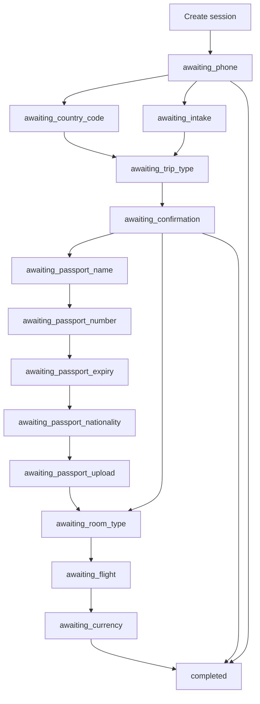
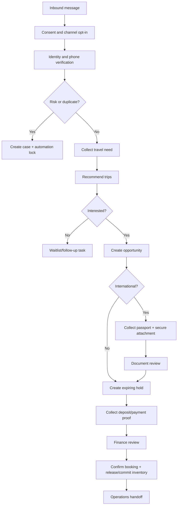

# Agent Flow Analysis

Date: 2026-06-17

Scope: `services/ai_agent/ai_agent_app/agent/session_flow.py`, `services/ai_agent/ai_agent_app/server.py`, `services/ai_agent/ai_agent_app/sheets/excel_gateway.py`, and bridge calls into `UnifiedCRMService`.

## Current State Machine

The agent is a deterministic in-memory session state machine. It is not an LLM planner or durable production conversation engine.

Current `SessionState.stage` values observed in code:

- `awaiting_phone`
- `awaiting_intake`
- `awaiting_name` legacy path
- `awaiting_country_code`
- `awaiting_trip_type`
- `awaiting_confirmation`
- `awaiting_passport_name`
- `awaiting_passport_number`
- `awaiting_passport_expiry`
- `awaiting_passport_nationality`
- `awaiting_passport_upload`
- `awaiting_room_type`
- `awaiting_flight`
- `awaiting_currency`
- `completed`

## Session Stages

### awaiting_phone

Purpose:

- Collect WhatsApp number.
- Normalize phone.
- Preview customer identity.

Transitions:

- To `awaiting_country_code` if country cannot be inferred.
- To `awaiting_intake` if no traveler is found.
- To `awaiting_trip_type` if traveler match is safe.
- To `completed` if handoff is required.

Risks:

- Session can begin without customer name, making phone/name conflict detection weaker in legacy phone-only path.

### awaiting_intake

Purpose:

- Collect new traveler data via form.

Transitions:

- To `awaiting_country_code` if phone country still unclear.
- To `awaiting_trip_type` if safe.
- To `completed` if handoff required.

Risks:

- Intake validation is minimal.
- No consent capture.

### awaiting_country_code

Purpose:

- Confirm numeric country code for ambiguous phone.

Transitions:

- To `awaiting_trip_type` after normalization and preview.

Broken behavior:

- After confirming country code, the code sets `awaiting_trip_type` even if preview indicates not found or handoff. That means the country-code branch is less protective than the primary phone/intake paths.

### awaiting_trip_type

Purpose:

- Resolve local/international from number or text.

Transitions:

- To `awaiting_confirmation` after preview with trip recommendations.

Logic:

- `1` means local.
- `2` means international.
- Text is normalized through phase-1 helper.

### awaiting_confirmation

Purpose:

- Customer selects a recommended trip or declines.

Transitions:

- `no/later/stop` to `completed` with no lead written.
- Valid selected trip calls `run_sales_cycle`.
- International trips go to passport collection.
- Local trips go to room type.

Important:

- Lead is written only after customer selects a trip, not merely after trip recommendations.

### Passport Stages

Purpose:

- Collect passport name, number, expiry, nationality, and attachment reference for international trips.

Transitions:

- Sequentially through fields, then `awaiting_passport_upload`, then room type after `done` or `skip`.

Risks:

- Passport fields are not clearly persisted to traveler or booking.
- Expiry is not validated.
- Upload can be skipped.
- Sensitive data is stored in memory and returned in session JSON.

### awaiting_room_type

Purpose:

- Choose Single/Double/Triple.

Logic:

- Checks selected trip available room counts from preview/final result.
- Rejects unavailable room type in conversation before service-level booking creation.

Transitions:

- To `awaiting_flight`.

### awaiting_flight

Purpose:

- Ask if customer wants flights.

Logic:

- Positive or `1` means `With Flight`.
- Any other value becomes `Without Flight`.

Risk:

- Invalid input defaults to without flight instead of retrying.

### awaiting_currency

Purpose:

- Ask payment currency.

Logic:

- USD or `2` means USD.
- Everything else means EGP.

Transitions:

- Calls `gateway.create_booking`, which creates booking draft.
- Sets `completed`.

Risks:

- Invalid input defaults to EGP.
- Flow ends after draft creation but asks if customer wants to confirm by deposit without accepting the answer.

### completed

Purpose:

- Terminal state.

Behavior:

- Further messages receive "already completed" style response.

Risks:

- No resume or post-completion intent handling.
- No transition from booking draft to confirmed payment.

## Why Sessions End

Sessions end when:

- Handoff is required during phone/intake.
- Customer declines trip interest in confirmation stage.
- Booking draft is created.
- Missing final result or trip ID causes an error and completes the session.
- User sends message after completed stage and receives a completed-session response.

Sessions do not end because of:

- Timeout.
- User inactivity.
- Operator takeover.
- Confirmed payment.
- Conversation channel closure.
- Error recovery policy.

## Missing States

Production states needed:

- `awaiting_consent`
- `awaiting_identity_verification`
- `awaiting_destination`
- `awaiting_date_window`
- `awaiting_budget`
- `awaiting_party_size`
- `awaiting_roommate_preference`
- `awaiting_waitlist_confirmation`
- `awaiting_payment_method`
- `awaiting_deposit_upload`
- `payment_under_review`
- `booking_confirmed`
- `booking_cancelled`
- `human_takeover_active`
- `human_takeover_resolved`
- `automation_paused`
- `automation_resumed`
- `attachment_review_pending`
- `passport_review_pending`
- `visa_handoff_required`

## Broken Or Weak States

### awaiting_country_code

Weakness:

- Does not branch consistently for not-found or handoff after preview.

Impact:

- Ambiguous-phone customers may bypass intended intake/handoff behavior.

### awaiting_flight

Weakness:

- Any non-positive input becomes "Without Flight".

Impact:

- Customer typo can silently select no flight.

### awaiting_currency

Weakness:

- Any non-USD input becomes EGP.

Impact:

- Customer typo can silently select EGP.

### completed

Weakness:

- Used for success, decline, handoff, and fatal errors.

Impact:

- No operational distinction between clean completion, rejected customer, handoff, or failed automation.

### Passport Upload

Weakness:

- User can type `skip`.
- File upload reference remains session-level.

Impact:

- International booking can proceed without persisted passport document.

## Recommended Production Flow

Production requirements:

- Durable session store.
- Idempotent inbound message handling.
- Channel identity mapping.
- Automation lock.
- Human inbox integration.
- Strong validation for each selection stage.
- Explicit terminal states.
- Payment and document review states.
- Audit trail for every state transition.

