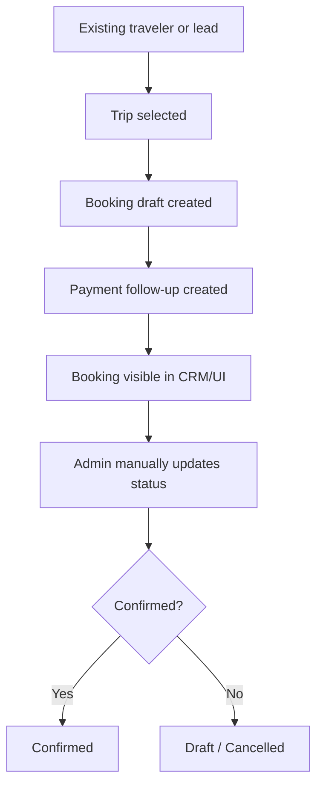
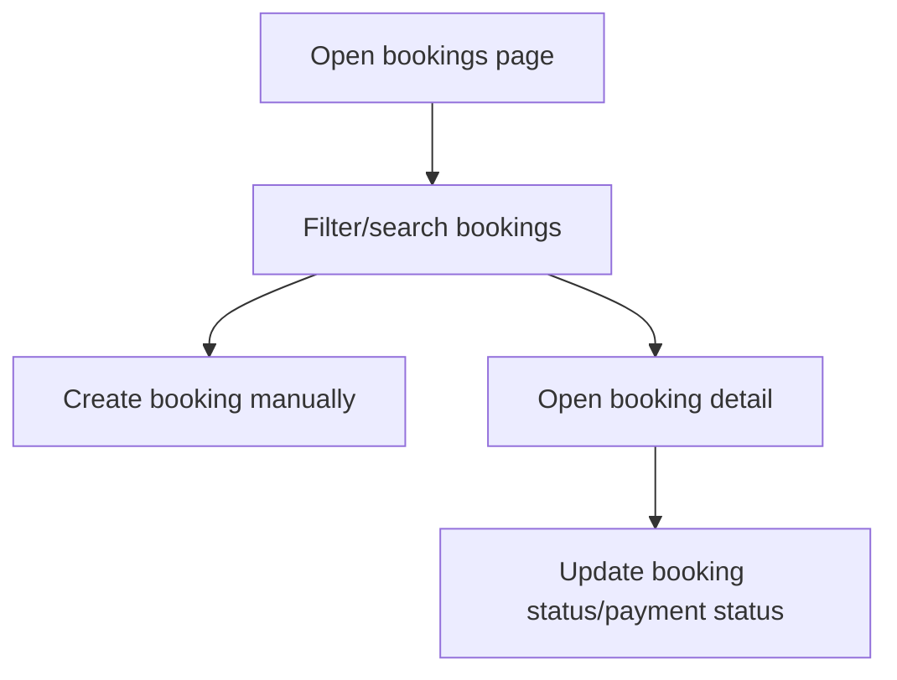
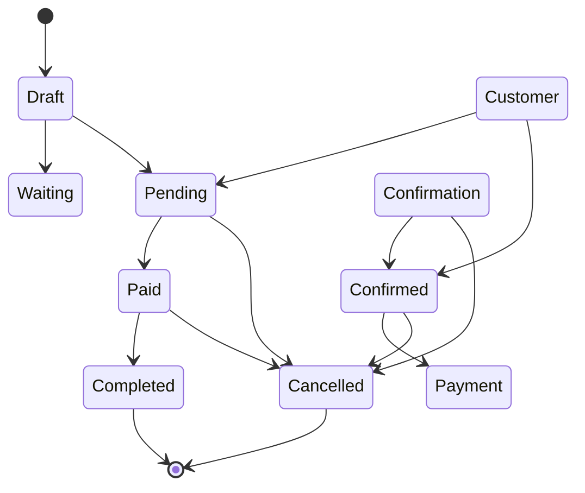

# Booking Lifecycle Redesign

## 1. Current Booking Workflow

Today the system has two booking entry paths:

1. Agent / CRM booking draft creation through `UnifiedCRMService.create_booking()`.
2. Admin CRM booking creation and manual status edits through `/bookings` in the Flask CRM.

The active workflow is:



Agent flow:

```mermaid
flowchart TD
    A[Traveler matches CRM] --> B[Lead qualified]
    B --> C[Trip selected]
    C --> D[Room type selected]
    D --> E[Currency selected]
    E --> F[create_booking()]
    F --> G[session.stage = booking_created]
```

Admin flow:



## 2. Current Booking Statuses

The codebase currently exposes these booking statuses in the CRM UI:

```text
Draft
Confirmed
Cancelled
```

The code also uses payment statuses:

```text
Pending
Deposit Paid
Fully Paid
Refunded
```

There is also an agent session terminal state called `booking_created`, which is not the same thing as the booking record status.

## 3. Problems in Current Flow

1. Booking lifecycle is collapsed into a single draft-oriented state model.
2. Payment state is not modeled as a true lifecycle stage; it is just a field.
3. `booking_created` exists in the agent session, but the booking record itself is still just Draft / Confirmed / Cancelled.
4. There is no first-class `Waiting Customer` state for post-draft follow-up.
5. There is no first-class `Pending Confirmation` state for the handoff between draft creation and explicit approval.
6. Manual admin updates can jump status without any transition guardrails.
7. The CRM booking UI suggests a completed operational workflow, but the backend does not enforce a real lifecycle.
8. Returning traveler handling is not lifecycle-aware; the system can still drift into lead-style behavior instead of a booking-draft continuation.
9. Cancellation is a terminal record state, but there is no explicit cancellation reason model.
10. The current status vocabulary is too small for production operations and reporting.

## 4. Recommended Lifecycle

Recommended canonical booking lifecycle:

```text
Draft
Waiting Customer
Pending Confirmation
Confirmed
Payment Pending
Paid
Completed
Cancelled
```

Recommended meaning:

- `Draft`: booking record created, not yet presented to the customer.
- `Waiting Customer`: customer has seen the draft but has not replied or completed details.
- `Pending Confirmation`: operational team is waiting for an explicit accept/reject decision.
- `Confirmed`: customer accepted the booking or team locked the booking.
- `Payment Pending`: booking is confirmed but deposit/full payment is not yet received.
- `Paid`: payment has been received.
- `Completed`: travel finished and booking is closed out.
- `Cancelled`: terminal cancellation.

## 5. Transition Rules

Recommended allowed transitions:



Operational rules:

- `Draft` should only move forward, never back to a lead-like state.
- `Waiting Customer` should only move to `Pending Confirmation`, `Confirmed`, or `Cancelled`.
- `Pending Confirmation` should only move to `Confirmed` or `Cancelled`.
- `Confirmed` should usually move to `Payment Pending` unless the payment is already settled.
- `Payment Pending` should move to `Paid` or `Cancelled`.
- `Paid` should move to `Completed` or, in exceptional cases, `Cancelled` with refund handling.
- `Completed` and `Cancelled` are terminal states.

## 6. Returning Traveler Flow

Required behavior:

```text
Existing traveler
↓
Booking Draft
```

Instead of duplicate lead creation, a returning traveler should:

1. Match identity first.
2. Reuse the existing traveler record.
3. Create or continue a booking draft.
4. Attach the booking to the existing traveler and lead history.
5. Avoid generating a new lead unless the identity is genuinely unresolved.

This matters because booking intent for known travelers is operationally different from first-contact lead capture.

## 7. Required DB Changes

No migration is being proposed in this document, but the data model needs the following additions in the eventual implementation:

- Add a canonical booking lifecycle field if the team wants to separate lifecycle from legacy `booking_status`.
- Add explicit payment lifecycle field(s) if payment needs to be tracked independently from booking status.
- Add cancellation reason and cancellation timestamp fields.
- Add confirmation timestamp.
- Add payment received timestamp.
- Add completion timestamp.
- Add operator/source audit fields for who moved the booking and why.

The existing `trip_bookings` rows must be preserved.

## 8. Required API Changes

The booking API surface needs lifecycle-aware endpoints:

- Create booking draft
- Update booking lifecycle status
- Update payment lifecycle status
- Confirm booking
- Mark payment received
- Mark booking completed
- Cancel booking

The current `/bookings/<booking_id>/status` endpoint is too generic for production lifecycle control.

## 9. Required CRM UI Changes

The CRM should expose:

- A lifecycle-aware status selector, not just Draft / Confirmed / Cancelled.
- Separate display for booking lifecycle and payment lifecycle.
- Timeline / event trail for booking progress.
- Filters by lifecycle stage.
- Fast access to pending confirmation and payment pending queues.
- Clear traveler-centric booking history in traveler detail pages.

The current booking list/detail screens are useful, but they are too coarse for real operations.

## 10. Required Agent Changes

The agent should:

- Create booking drafts only after traveler identity is resolved.
- Treat returning travelers as existing traveler booking flows, not new lead creation.
- Surface booking lifecycle language in the confirmation copy.
- Avoid saying a booking is finalized when it is only a draft.
- Distinguish between draft creation, customer confirmation, and payment completion.
- Keep the session stage separate from the booking record lifecycle.

Current agent state is already using `booking_created`, which is a good draft boundary, but it is not a production booking lifecycle.

## 11. Tests Required

Required coverage before lifecycle redesign ships:

1. Draft creation for existing traveler.
2. Draft creation for new traveler.
3. Draft to waiting customer transition.
4. Waiting customer to pending confirmation transition.
5. Pending confirmation to confirmed transition.
6. Confirmed to payment pending transition.
7. Payment pending to paid transition.
8. Paid to completed transition.
9. Cancelled transition from each allowed pre-terminal state.
10. Invalid transition rejection.
11. Returning traveler flow does not create duplicate lead records.
12. Agent session stage remains distinct from booking lifecycle.
13. Admin UI renders lifecycle states correctly.
14. Booking event trail records every lifecycle change.

## Bottom Line

The current system supports draft bookings well enough for demo and internal operations, but it does not yet have a real production booking lifecycle. The redesign should introduce explicit lifecycle states, payment separation, and returning-traveler continuity without collapsing everything back into lead creation.
