# Current Workflows

Date: 2026-06-17

This document describes workflows implemented in the current codebase. Where behavior is incomplete or inferred, it is marked as such.

## A. New Traveler Flow

Code paths:

- `services/ai_agent/ai_agent_app/agent/session_flow.py`
- `services/crm/system_services/unified_service.py`
- `apps/api/app/routes/travelers.py`
- `apps/api/app/routes/leads.py`

Steps:

1. Customer starts demo session or admin creates traveler/lead manually.
2. System asks for WhatsApp number first in demo chat.
3. Phone is normalized.
4. If country cannot be inferred, customer is asked for country code.
5. System previews identity.
6. If no traveler is found, demo asks for intake form: full name, birthday, gender, nationality, WhatsApp.
7. When customer selects a trip and confirms interest, `record_agent_outcome` creates traveler, interaction, lead, and event trail.
8. Traveler receives sequential ID such as `TR00001`.
9. Lead is linked to traveler.
10. Sheet sync is attempted.

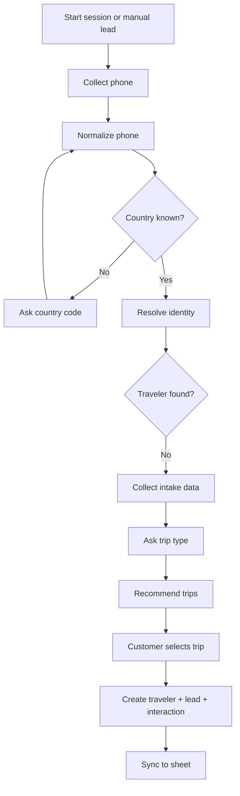

Known gaps:

- New traveler creation requires enough flow progress; phone-only session does not immediately create DB record.
- No consent capture.
- No validation workflow for birthday/gender/nationality quality.

## B. Returning Traveler Flow

Steps:

1. Customer provides WhatsApp number.
2. Phone normalization creates lookup variants.
3. `resolve_identity` finds one traveler.
4. Name compatibility is checked if name is known.
5. If status is normal, system continues.
6. Demo fills customer name from traveler profile.
7. Customer selects trip type.
8. Agent suggests trips and creates/updates latest lead after confirmation.

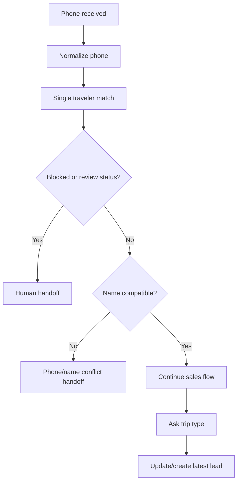

Known gaps:

- Returning traveler authentication is phone-based only.
- No explicit "welcome back" account verification.
- No customer preference recommendation logic beyond stored status/tier and trip type.

## C. Duplicate Phone Flow

Steps:

1. Phone normalization produces lookup variants.
2. Identity resolution finds more than one traveler row.
3. System sets `match_status = multiple_matches`.
4. `handoff_required = true`.
5. `handoff_reason = duplicate_phone_match`.
6. Agent flow ends as completed with handoff message.
7. Manual lead route creates a `HandoffQueue` item.
8. Admin can merge duplicate travelers through Flask duplicates page or React/middleware prototype.

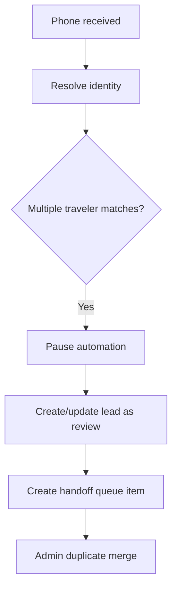

Known gaps:

- Duplicate detection primarily groups exact `phone_lookup_key`.
- Merge is not fully audited as a governed identity-resolution event.
- Sheet sync after merge is not clearly complete for all affected records.

## D. Protected Traveler Flow

Protected statuses found in code:

- `blacklisted`
- `blacklist`
- `payment risk`
- `high maintenance`

Steps:

1. Identity resolution finds a single traveler.
2. Traveler status is inspected.
3. Blacklisted traveler gets blocked sales flow and critical priority.
4. Payment risk/high maintenance gets handoff-required review.
5. Automation does not proceed to normal booking flow.

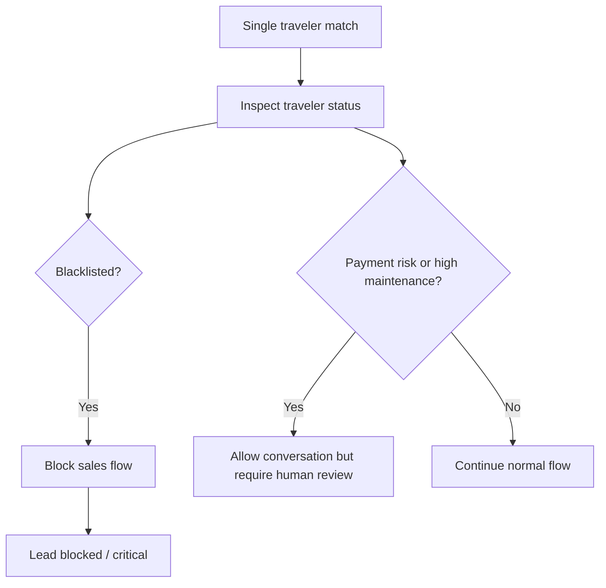

Known gaps:

- Protected traveler statuses are plain strings.
- No configurable protected-status policy UI.
- No role-based approval to override.

## E. Lead Creation Flow

Manual lead path:

1. Admin opens Leads page.
2. Admin enters customer name, phone, stage, priority, source, channel, trip preferences, follow-up, language, notes.
3. Route calls `UnifiedCRMService.record_agent_outcome`.
4. Service resolves identity.
5. Service creates/updates traveler as needed.
6. Service creates interaction.
7. Service upserts lead.
8. Service creates event trail records.
9. If handoff required, route creates `HandoffQueue`.

Agent lead path:

1. Customer selects trip after recommendation.
2. Session calls `gateway.run_sales_cycle`.
3. Bridge calls `UnifiedCRMService.record_agent_outcome`.
4. Same DB write-through occurs.

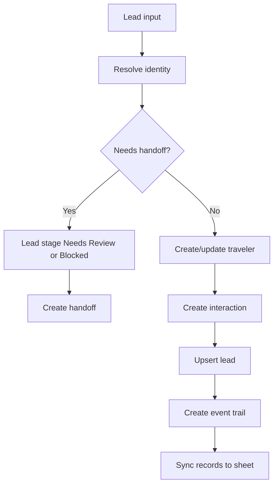

Known gaps:

- Lead upsert can update latest lead by phone/traveler instead of always creating a new opportunity.
- No formal lead owner or SLA.
- Stage taxonomy is string-heavy and inconsistent with ERP/CRM stage conventions.

## F. Booking Creation Flow

Steps:

1. Booking can be created from demo agent after lead confirmation or from Flask Bookings page.
2. Required values: trip ID, traveler ID, room type.
3. `UnifiedCRMService.create_booking` validates room type.
4. Service begins SQLite immediate transaction.
5. Trip must exist and `sales_status` must be `Open`.
6. Capacity is checked as remaining minus draft holds.
7. Booking ID is generated from traveler/trip/sequence.
8. `trip_bookings` row is inserted with `Draft` status.
9. Draft hold count is incremented for selected room type.
10. Traveler `last_booking_id` is updated.
11. Lead is moved to booking draft stage when lead ID is present.
12. Booking event trail is written.
13. Sheet sync is attempted.

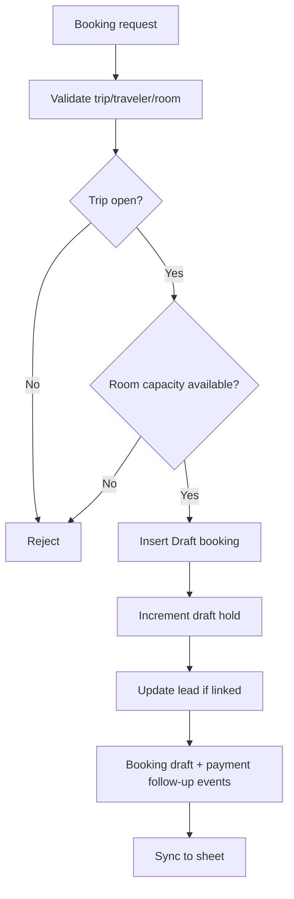

Known gaps:

- No hold expiry.
- No release on cancellation.
- No payment object.
- No passenger/rooming details beyond room type.

## G. Booking Confirmation Flow

Current behavior:

1. Admin opens booking detail.
2. Admin changes `booking_status` to `Confirmed`, `Draft`, or `Cancelled`.
3. Admin changes `payment_status` to `Pending`, `Deposit Paid`, `Fully Paid`, or `Refunded`.
4. Route commits direct field update.
5. Route creates a booking event if status/payment/note exists.
6. Sheet sync is attempted.

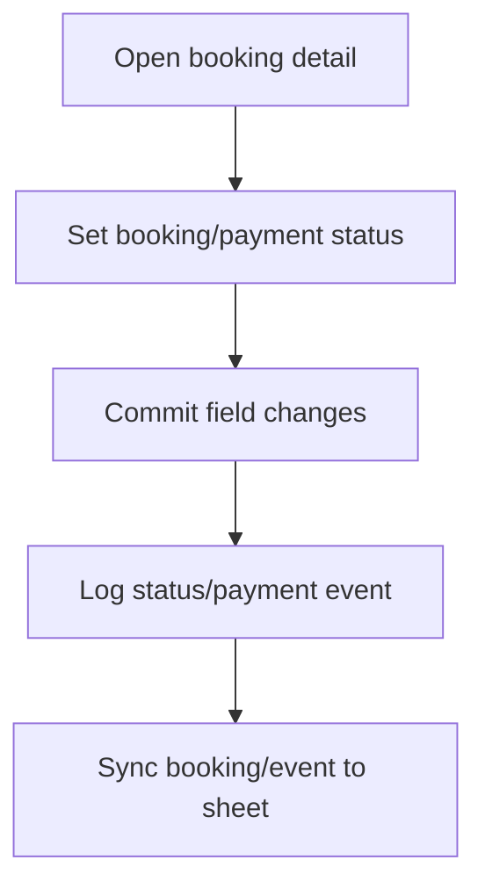

Important finding:

This is not a true confirmation workflow. It is a manual status update. There is no deposit validation, receipt, confirmation timestamp, customer notification, audit approval, inventory finalization, or operations handoff.

## H. Trip Recommendation Flow

Steps:

1. Customer selects local or international.
2. Trip type is normalized.
3. System reads DB trips through `UnifiedCRMService.build_trip_result`.
4. Inactive statuses are excluded.
5. Future dated trips with capacity or availability notes are returned as open trips.
6. Trips without start date but with availability/TBD/capacity are returned as Date TBD.
7. Agent lists up to top 3 trip options.

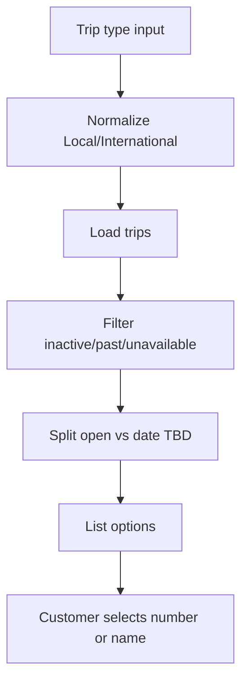

Known gaps:

- No destination preference, budget, date range, room preference, traveler segment, or CRM personalization scoring.
- Discounts are read as notes, not structured offers.

## I. Human Handoff Flow

Triggers:

- Duplicate phone.
- Blacklisted traveler.
- Phone/name conflict.
- Payment risk/high maintenance.
- Manual admin action from lead detail.
- Unknown visa destination recommends handoff but does not create a CRM handoff record.
- Optional post-trip handoff message when enabled.

Steps:

1. Trigger occurs.
2. Lead is marked with `handoff_required` and reason.
3. `HandoffQueue` may be created depending on path.
4. Socket notification is emitted.
5. Handoff board shows Pending/In Progress/Resolved.
6. Admin can assign, drag status, quick resolve, or add notes.

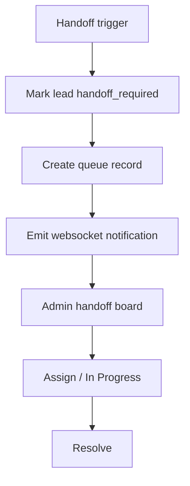

Known gaps:

- Not every handoff recommendation creates a queue item.
- No channel-level automation lock.
- No SLA, escalation, or handoff ownership rules.
- No full conversation transcript handoff package.

## J. Passport Flow

Implemented in demo agent only.

Steps:

1. Customer selects international trip.
2. Agent calls `run_sales_cycle` and creates lead.
3. Session stage changes to `awaiting_passport_name`.
4. Agent collects:
   - Passport full name
   - Passport number
   - Passport expiry
   - Passport nationality
5. Agent asks customer to upload passport image.
6. Upload endpoint saves local file and stores reference in session.
7. Customer types `done` or `skip`.
8. Flow continues to room type.

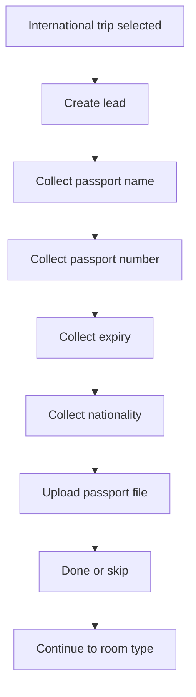

Critical gap:

Passport values are session state, not a complete persisted secure document workflow.

## K. Attachment Flow

Implemented endpoint:

- `POST /api/session/<session_id>/passport_attachment`

Steps:

1. Frontend sends multipart file.
2. Server validates file exists.
3. Server validates extension.
4. Server checks file size is <= 10 MB.
5. Server saves to local `uploads/passport/<session_id>/<secure_filename>`.
6. Server stores relative reference on session state.

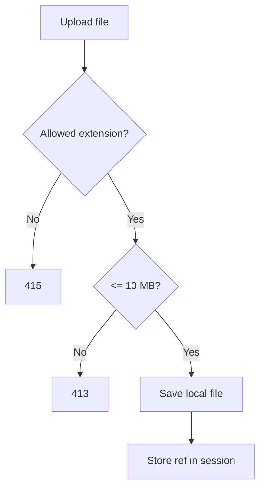

Critical gaps:

- No `Attachment` model.
- No traveler/booking foreign key persistence.
- No encryption, virus scan, access policy, signed URLs, retention, or deletion.
- Allowed list includes GIF/HEIC/WEBP in code, while client requirement mentions JPG/JPEG/PNG/PDF.

## L. Admin CRM Flow

Main admin navigation:

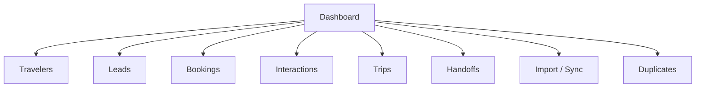

Admin actions:

- View dashboard KPIs.
- Search/filter travelers.
- Create traveler.
- Edit traveler.
- Mark traveler inactive.
- Export travelers CSV.
- View traveler 360 profile.
- Search/filter leads.
- Create manual lead.
- Update lead.
- Advance lead stage.
- Create handoff from lead.
- Search/filter bookings.
- Create booking draft.
- Update booking/payment status.
- Search/filter trips.
- Create/update/cancel trip.
- Update trip inventory.
- View interactions.
- Manage handoff board.
- Import Excel or Google Sheets.
- Review sync issues and retry.
- Review/merge duplicates.

Known gaps:

- Admin auth is insufficient for production.
- No roles/permissions.
- No granular audit trail for admin actions.
- No CRM settings UI for handoff rules/persona/config.

