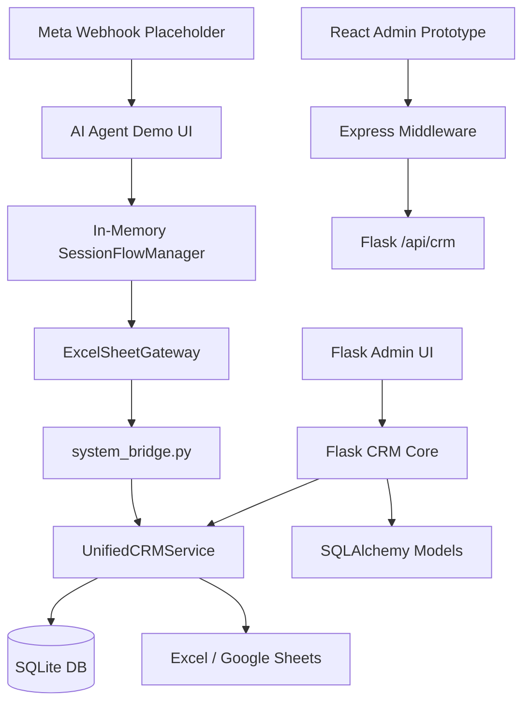

# Product Audit Report

Date: 2026-06-17

Scope: actual code inspection of `apps/api`, `services/ai_agent`, `services/crm`, `apps/middleware`, `apps/admin-web`, `database/schema`, `tests`, and active templates/static UI files. This report intentionally does not treat older phase plans as product truth unless current code implements them.

## Executive Summary

Rahma Travel OS is currently a demo/MVP travel CRM with a Flask + SQLite core, workbook/Google Sheets synchronization, a spreadsheet-backed AI agent demo, a server-rendered CRM admin UI, and a small TypeScript middleware/React admin prototype. The product can demonstrate traveler lookup, lead creation, duplicate-phone safety, blacklist safety, trip recommendation, booking draft creation, handoff queueing, passport intake stages, local passport attachment upload metadata, and basic visa table lookup.

It is not production ready. The main blockers are data-governance risk, split sources of truth, weak authentication/authorization, incomplete attachment/passport persistence, no durable conversation/session layer, limited booking lifecycle logic, and an unfinished Instagram integration boundary.

## What The Product Currently Does

- Manages travelers, leads, trips, trip bookings, interactions, handoff queue records, copy templates, community events, and booking event trail records.
- Imports operational data from Excel or Google Sheets into SQLAlchemy models.
- Writes selected CRM mutations back to Excel or Google Sheets via `UnifiedCRMService`.
- Normalizes phone numbers and creates lookup variants for duplicate detection.
- Resolves traveler identity during lead creation:
  - Creates a new traveler when no phone match is found.
  - Reuses existing traveler when phone and name are compatible.
  - Requires human handoff for duplicate phone matches.
  - Requires human handoff for phone/name conflict.
  - Blocks sales flow for blacklisted travelers.
- Recommends upcoming trips using DB trip inventory and availability logic.
- Creates booking drafts and increments draft holds for selected room type.
- Logs booking-related events such as inquiry received, trip suggested, lead qualified, booking draft created, payment follow-up, and handoff required.
- Provides a server-rendered Flask CRM for admins:
  - Dashboard
  - Travelers
  - Leads
  - Bookings
  - Trips
  - Interactions
  - Handoff Queue
  - Import / Sync
  - Duplicates
  - Sync Issues
- Provides a demo AI chat/intake flow through `services/ai_agent`.
- Provides placeholder Instagram webhook verification/receive endpoints.
- Provides a prototype React admin panel through TypeScript middleware for identity merge and placeholder handoff/copy/settings panels.

## Major Modules

### Flask CRM Core

Path: `apps/api`

Main responsibilities:

- SQLAlchemy models.
- CRM routes and server-rendered admin pages.
- Excel/Google Sheets import.
- Traveler, lead, booking, trip, handoff CRUD-ish workflows.
- Identity duplicate merge.

Key files:

- `apps/api/app/__init__.py`
- `apps/api/app/models/*.py`
- `apps/api/app/routes/*.py`
- `apps/api/app/services/importer.py`
- `apps/api/app/services/identity.py`

### Shared CRM System Service

Path: `services/crm/system_services`

Main responsibilities:

- Direct SQLite writes outside SQLAlchemy sessions.
- Phone normalization.
- Identity resolution.
- Lead upsert.
- Interaction creation.
- Booking draft creation.
- Booking event trail.
- Trip availability calculation.
- Sheet synchronization.
- Runtime schema patches for passport columns and sync queue.

Key files:

- `services/crm/system_services/unified_service.py`
- `services/crm/system_services/phone_normalization.py`
- `services/crm/system_services/field_mapping.py`

### AI Agent Demo

Path: `services/ai_agent`

Main responsibilities:

- In-memory session flow.
- Demo web chat/intake UI.
- Workbook-backed CRM stats and copy.
- Bridges agent actions into the DB-first `UnifiedCRMService`.
- Passport collection stage flow and local upload endpoint.
- Visa table lookup endpoint.
- Instagram webhook placeholder.

Key files:

- `services/ai_agent/ai_agent_app/agent/session_flow.py`
- `services/ai_agent/ai_agent_app/server.py`
- `services/ai_agent/ai_agent_app/sheets/excel_gateway.py`
- `services/ai_agent/ai_agent_app/system_bridge.py`

### TypeScript Middleware

Path: `apps/middleware`

Main responsibilities:

- Express wrapper around Flask identity APIs.
- Basic health endpoint.
- Future V2 boundary.

Implemented:

- `GET /api/health`
- `GET /api/crm/duplicates`
- `POST /api/crm/resolve-identity`

Not actually implemented:

- Real handoff service route.
- Auth.
- Audit logs.
- Rate limiting.
- Durable queue.
- Direct Prisma-backed production API.

### React Admin Prototype

Path: `apps/admin-web`

Main responsibilities:

- Prototype admin control center.
- Identity duplicate merge UI through middleware.
- Placeholder copy, handoff, settings panels.

This is not the main CRM UI today.

### Database Layer

Active runtime database: SQLite through Flask/SQLAlchemy and direct `sqlite3`.

Future/aspirational schema: `database/schema/schema.prisma` uses PostgreSQL and a simplified V2 data model. It is not the current production model.

## Current Architecture

The system is hybrid and transitional. The real business mutations are concentrated in `UnifiedCRMService`, but the Flask route layer sometimes uses SQLAlchemy directly and sometimes delegates to `UnifiedCRMService`. The demo agent reads workbook data for some UI stats/copy, but writes important outcomes through the DB-first service.

## Current Workflows

Implemented workflows include:

- Traveler create/update/inactivate/export.
- Traveler duplicate detection and merge.
- Manual lead creation with identity safety and handoff generation.
- Agent lead creation after trip interest confirmation.
- Trip list/create/update/cancel/inventory update.
- Trip recommendation by trip type, date, status, and remaining capacity.
- Booking draft creation with capacity hold.
- Booking status/payment update.
- Handoff queue create/update/pending count and board UI.
- Interaction logging.
- Import from Excel/Google Sheets.
- Sync failure capture in `sync_queue` and retry UI.
- Passport info collection in demo session for international trips.
- Passport file upload endpoint storing a local relative path in session state.
- Visa requirement lookup from a workbook table.

## Missing Workflows

- Real booking confirmation workflow with deposit, payment proof, invoice/receipt, confirmation timestamp, and inventory finalization.
- Cancellation workflow that releases or reconciles draft holds.
- Expired draft hold cleanup.
- Waitlist workflow after no trip, sold out trip, or customer says "later".
- Human takeover lifecycle that truly stops automation per customer/channel and resumes only by operator action.
- Assignment SLA, escalation, ownership, and resolution taxonomy for handoffs.
- Passport persistence from session into traveler/booking records.
- Attachment model, attachment storage policy, scan/validation, access control, and audit log.
- Data subject consent and PII controls.
- Customer-facing profile/traveler portal.
- Full returning traveler journey beyond phone/name match.
- Protected traveler workflow for VIP, high-maintenance, payment-risk, or sensitive customers.
- Real Instagram DM ingestion, idempotency, retry, signature validation hardening, rate limits, and outbound messaging.
- ERP-grade accounting, payment, supplier/DMC, rooming list, operations, and settlement workflows.

## Business Logic Discovered In Code

### Identity And Phone Logic

- Phone normalization is centralized in `services/crm/system_services/phone_normalization.py`.
- Supported country hints include Egypt, Saudi Arabia, UAE, Kuwait, Qatar, Bahrain, Oman, Jordan, Lebanon, UK, and US/Canada.
- Unknown phone country requires confirmation.
- Egyptian local mobile numbers can default to country code 20.
- Lookup variants include E.164, digits-only, `country:local`, local number, and raw input for backward compatibility.

### Traveler Matching Logic

Implemented in `UnifiedCRMService.resolve_identity`.

- No match: create new traveler.
- Multiple matches: `handoff_required = true`, reason `duplicate_phone_match`.
- Single match with blocked status `blacklisted` or `blacklist`: handoff and block with reason `blacklisted_customer`.
- Single match with incompatible name: handoff with reason `phone_name_conflict`.
- Single match with review status `payment risk` or `high maintenance`: handoff with reason derived from status.
- Otherwise continue sales flow.

### Lead Stage Logic

Implemented in `UnifiedCRMService.derive_lead_stage`.

- Blacklist: `Blocked`, priority `Critical`.
- Handoff: `Needs Review`, priority `High`.
- VIP with open trips: `VIP Priority`.
- VIP without open trips: `VIP Follow Up`.
- Repeat with open trips: `Repeat Priority`.
- Repeat without open trips: `Repeat Follow Up`.
- Open trips: `Qualified`.
- Date TBD trips: `Follow Up Needed`.
- New customer no trip: `New Lead`.
- Existing traveler no trip: `Existing Traveler`.

### Follow-Up Logic

Implemented in `UnifiedCRMService.derive_follow_up`.

- Blocked: `Do Not Contact`.
- Handoff: `Urgent`, due today.
- Open trips: `Follow Up Soon`, due in 2 days.
- Date TBD trips: `Awaiting Dates`, due in 7 days.
- New customer: `Qualify Lead`, due in 3 days.
- Otherwise: `Monitor`, due in 14 days.

### Trip Recommendation Logic

Implemented in `UnifiedCRMService.get_available_trips` and `_trip_is_candidate`.

- Trip type normalized to Local or International.
- Excludes statuses: cancelled, closed, archived.
- Candidate if future start date and has available capacity or manual availability note.
- Candidate without start date only if availability note, date TBD status, or capacity exists.
- Open trips and Date TBD trips are separated.

### Booking Logic

Implemented in `UnifiedCRMService.create_booking`.

- Only room types `Single`, `Double`, `Triple` are supported.
- Trip must exist.
- Trip must have sales status `Open`.
- Selected room capacity must be configured.
- Available capacity is `remaining - draft_holds`.
- Booking creates a `Draft` by default.
- Draft hold increments for selected room type.
- Traveler `last_booking_id` is updated.
- Lead stage is moved to `Booking Draft Created`, `VIP Booking Draft`, or `Repeat Booking Draft` when lead ID is present.
- Payment follow-up event is logged.

### Handoff Logic

- Manual lead creation creates `HandoffQueue` for conflicts/blacklist.
- Agent lead creation logs `handoff_required` booking events.
- Handoff board supports `Pending`, `In Progress`, `Resolved`, owner, assigned_to, notes.
- WebSocket event emits new handoff notification.
- There is no durable automation-stop registry per channel.

### Passport And Attachments

- Traveler model has passport fields.
- Startup/service runtime backfills passport columns into SQLite if missing.
- Agent session collects passport name, number, expiry, nationality, and upload reference.
- Upload endpoint validates extension and size and stores a file under local `uploads/passport/<session_id>`.
- The collected passport session fields are not reliably persisted into traveler, lead, booking, or an attachment model.

## Technical Debt

- Two persistence APIs write to the same SQLite database: SQLAlchemy and direct `sqlite3`.
- Startup/runtime DDL patches passport and sync queue instead of proper migrations.
- Workbook/Google Sheets remain part of the operational write path, creating split source of truth and sync failure risk.
- Sheet sync failures are often swallowed in route code.
- Some UI text/files show mojibake encoding artifacts.
- React admin and Prisma schema are ahead of the running backend.
- Tests rely heavily on phase-specific temporary schemas and workbook fixtures.
- IDs are generated from max existing values, which is unsafe under concurrency.
- The same business concepts appear in several places with different names and enum values.
- `TripBooking.lead_id` and other keys are not consistently real foreign keys.
- Passport and attachment handling is not modeled as secure document management.
- Demo sessions are in memory and disappear on restart.
- Flask auth is minimal and not consistently applied to all sensitive routes.

## Risks

### Business Risks

- Sales staff may believe a booking is confirmed when it is only a draft.
- Draft holds can accumulate without expiry or release logic.
- Duplicate merge may preserve the wrong master profile because selection is manual and not fully audited.
- Handoff may be created without actually stopping automation on an external channel.
- Customer passport data may be collected without adequate compliance controls.

### Technical Risks

- Concurrent traveler or booking creation can produce ID collisions or stale capacity calculations outside the immediate SQLite lock.
- SQLite is not adequate for multi-user production CRM/agent workloads.
- Async Google Sheets sync uses daemon threads without durable retries.
- Direct local file uploads are not safe for production PII documents.
- `sync_queue` is lightweight and not a real job system.
- Middleware and Prisma schema may mislead stakeholders into thinking V2 is implemented.

### Security And Compliance Risks

- Passport number and images are sensitive PII.
- Attachment storage lacks malware scanning, encryption, retention policy, access control, and audit log.
- Meta webhook handler is placeholder-only.
- Admin surfaces need proper auth, role-based permissions, CSRF protection, request audit logs, and secret management.

## Demo Readiness

The product is demo-ready for controlled scenarios:

- New traveler intake.
- Returning traveler match.
- Duplicate phone safety.
- Blacklisted traveler block.
- Trip recommendation.
- Lead write-through.
- Booking draft creation with capacity hold.
- Handoff queue display/update.
- Passport prompt for international trips.
- Basic attachment upload demo.
- Visa table lookup demo.

Demo limitations must be disclosed:

- Booking confirmation is not real payment/confirmation.
- Instagram integration is not real.
- Passport data is demo-grade.
- Attachments are local files.
- CRM screens are operational prototypes.
- React admin is not the main app.

## Production Readiness

Not production ready.

Minimum production readiness requires:

- One authoritative database.
- Proper migrations.
- Auth/RBAC/CSRF/audit logs.
- Durable background workers.
- Secure document storage.
- Real booking lifecycle.
- Hold expiry/release.
- Human takeover controls.
- Instagram production integration.
- Error monitoring and operational runbooks.
- Data retention and compliance policy for traveler/passport records.

