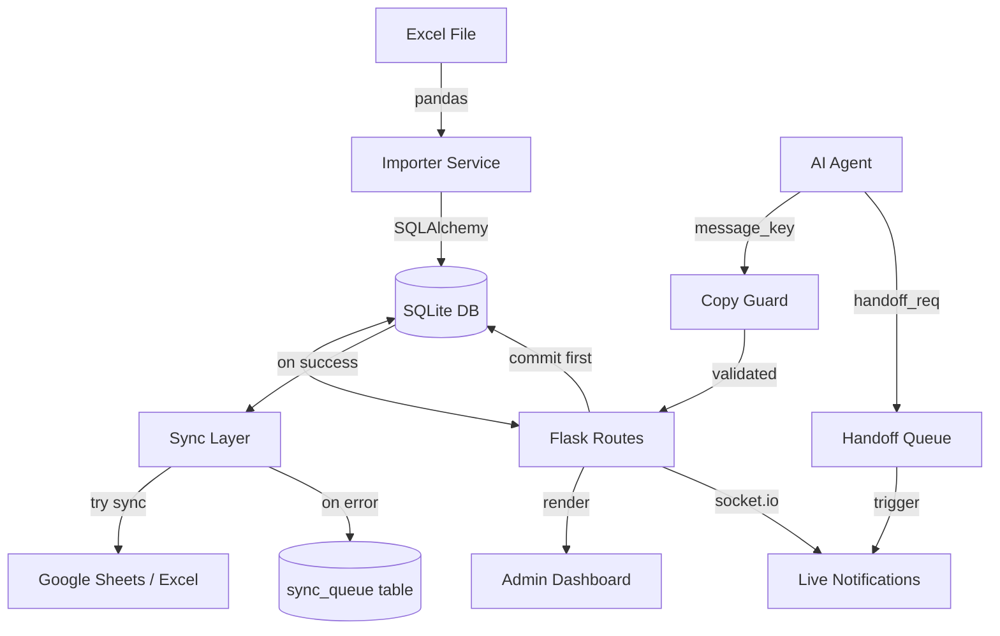

# Rahma Traveler Architecture

This document outlines the technical architecture of the Rahma Traveler Flask application, focusing on data integrity, automation, and real-time operations.

## Data Flow Lifecycle

The system transitions from a static Excel-based workflow to a dynamic, relational database environment:

1.  **Excel Ingestion**: Raw data from `travelers_database.xlsx` is processed using `pandas`.
2.  **SQLite Storage**: The `ImporterService` cleans and maps Excel rows to SQLAlchemy models, performing bulk upserts to the SQLite database.
3.  **Flask Routes**: Blueprints handle incoming requests, query the database, and process business logic via specialized services.
4.  **Templates**: Data is rendered into responsive Jinja2 templates for the Admin and CRM dashboards.

## Core Components

### 1. Copy Guard (Anti-Hallucination)
The **Copy Guard** acts as a deterministic barrier between the AI agent and the user. It prevents the AI from generating incorrect information (hallucinating) by:
-   **Template Enforcement**: Forcing the AI to use pre-approved message keys from the `DMCopyLibrary`.
-   **Variable Validation**: Before rendering, the system checks if all required placeholders (e.g., `{trip_price}`, `{departure_date}`) are provided.
-   **Strict Failures**: If a variable is missing, the system raises a `CopyGuardError` instead of guessing or sending an incomplete message.

### 2. Identity Resolver (Deduplication)
To maintain a "Single Source of Truth," the **Identity Resolver** manages traveler records:
-   **Phone Normalization**: Converts all incoming phone numbers to a standard E.164 format (`+20XXXXXXXXXX`).
-   **Lookup Keys**: Uses the last 10 digits of a phone number as a unique lookup key to identify duplicates across different country codes or formats.
-   **Data Consolidation**: The `merge_travelers` logic re-links all historical Bookings, Leads, and Interactions from duplicate "alias" records to a single "master" record, ensuring no data is lost during cleanup.

### 3. Handoff Queue (Real-Time Alerts)
The **Handoff Queue** manages the transition from AI automation to human agent intervention:
-   **Event Trigger**: When the AI detects a complex query or a high-priority lead, it POSTs a request to the handoff endpoint.
-   **WebSocket Integration**: The creation of a handoff record triggers an asynchronous event via **Flask-SocketIO**.
-   **Live Dashboard**: The Admin Kanban board receives this event instantly, updating the "Pending" column and playing an alert sound without requiring a page refresh.

### 4. Sync and Safety Layer (DB-First Architecture)
To prevent data corruption between the system database and the mirrored Google Sheets / Excel files, the system employs a **DB-First Architecture**:
-   **Transaction Priority**: Operations (Booking creation, Lead updates, etc.) are always committed to the SQLite database *first*.
-   **Safe Sheet Syncing**: After the DB commits, the system attempts to sync the changes to the configured sheet backend (`sync_agent_write_to_sheet`).
-   **Fault Tolerance**: If the sheet API fails (e.g., rate limits, network error), the DB transaction remains fully valid. The error is caught and logged into a dedicated `sync_queue` table instead of crashing the core process.
-   **Admin Resolution**: Administrators can monitor the `sync_queue` via the Sync Issues dashboard and manually re-trigger failed sync operations.
-   **Editable vs. Mirrored Fields**: 
    - *System Authoritative (Editable)*: Operational states (`lead_stage`, `booking_status`, `handoff_status`, `priority`, live inventory).
    - *Sheet Mirrored (Read-Only in Sheet)*: The Sheet acts as a downstream replica of the system. Direct edits to synced columns in the Sheet will be overwritten by the system upon the next sync event.

## System Diagram

